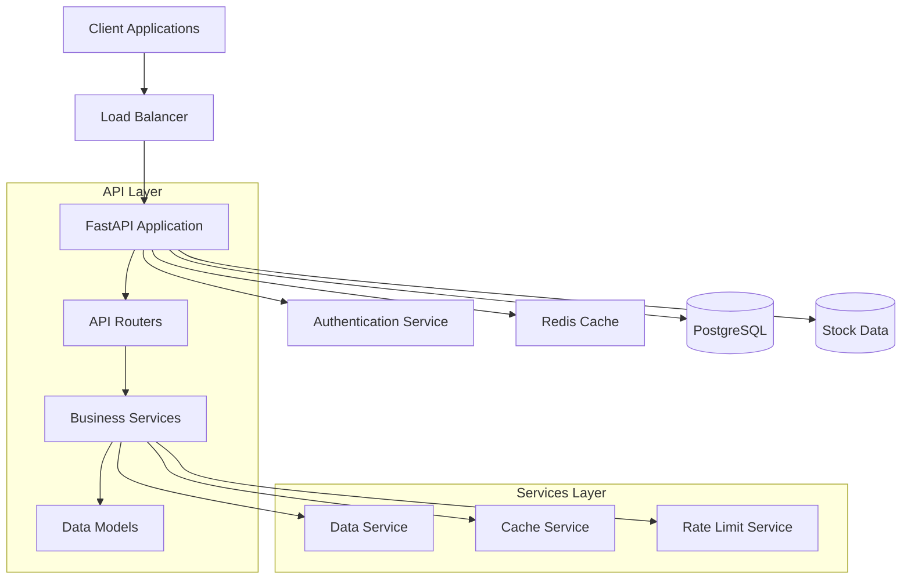
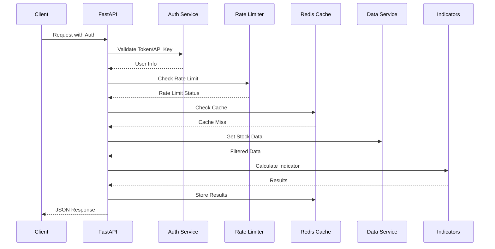

# Architecture Design Document

## System Overview

The Kalpi Tech API is a high-performance stock technical analysis API built using FastAPI, designed to serve technical indicators with tiered access control and enterprise-level scalability.

## Architecture Principles

### 1. **Modular Design**
- Clear separation of concerns
- Layered architecture (presentation, business logic, data access)
- Dependency injection for testability

### 2. **Performance First**
- Polars for high-performance data processing
- Redis caching for frequently accessed data
- Asynchronous processing where applicable

### 3. **Scalability**
- Horizontal scaling capability
- Stateless design
- Efficient database queries

### 4. **Security**
- JWT-based authentication
- API key support
- Rate limiting per tier
- Input validation and sanitization

## Component Architecture



## Detailed Component Design

### 1. **API Layer**

#### FastAPI Application (`app/main.py`)
- **Responsibility**: Application lifecycle, middleware, error handling
- **Key Features**:
  - Lifespan management for startup/shutdown
  - Global exception handling
  - CORS configuration
  - Health check endpoint

#### Routers (`app/routers/`)
- **Indicators Router**: Technical indicator endpoints
- **Auth Router**: Authentication and user management
- **Validation**: Pydantic models for request/response validation
- **Error Handling**: HTTP status codes and structured error responses

### 2. **Business Logic Layer**

#### Data Service (`app/services/data_service.py`)
- **Responsibility**: Stock data management and filtering
- **Key Features**:
  - Polars-based data loading from Parquet files
  - Symbol and date range filtering
  - Tier-based data access validation
  - Memory-efficient data operations

#### Cache Service (`app/services/cache_service.py`)
- **Responsibility**: Redis-based caching
- **Key Features**:
  - Intelligent cache key generation
  - TTL-based expiration
  - Cache invalidation strategies
  - Fallback handling for cache failures

#### Rate Limiting Service (`app/services/rate_limit_service.py`)
- **Responsibility**: API rate limiting per user tier
- **Key Features**:
  - Daily request counting
  - Tier-based limits
  - Automatic cleanup of old entries
  - Real-time limit checking

### 3. **Data Access Layer**

#### Database Models (`app/database/models.py`)
- **User**: Authentication and profile data
- **APIKey**: API key management
- **RequestLog**: Request auditing
- **Relationships**: Foreign key constraints

#### Database Service (`app/database/database.py`)
- **Connection Management**: SQLAlchemy engine and session management
- **Transaction Handling**: Proper session lifecycle
- **Error Handling**: Database-specific error handling

### 4. **Authentication Layer**

#### Authentication Service (`app/auth/`)
- **JWT Token Management**: Creation, validation, expiration
- **Password Hashing**: bcrypt-based secure hashing
- **API Key Management**: Generation and validation
- **Dependency Injection**: FastAPI dependencies for route protection

## Data Flow Architecture

### 1. **Request Processing Flow**



### 2. **Data Loading Strategy**

#### Startup Data Loading
- **Approach**: Load entire dataset into memory at startup
- **Rationale**: 
  - Faster query performance
  - Reduced I/O operations
  - Predictable latency
- **Trade-offs**: Higher memory usage vs. query performance

#### Alternative Strategies Considered
1. **On-demand loading**: Load data per request
   - Pros: Lower memory usage
   - Cons: Higher latency, more I/O

2. **Chunked loading**: Load data in chunks
   - Pros: Balanced memory usage
   - Cons: Complex cache management

3. **Database storage**: Store data in PostgreSQL
   - Pros: ACID compliance, complex queries
   - Cons: Higher latency, more complex setup

## Scalability Considerations

### 1. **Horizontal Scaling**

#### Stateless Design
- No server-side session storage
- JWT tokens for authentication
- Redis for shared state

#### Load Balancing
- Multiple API instances behind load balancer
- Session affinity not required
- Health checks for instance management

### 2. **Database Scaling**

#### Read Replicas
- Separate read/write operations
- Read replicas for heavy read operations
- Master-slave configuration

#### Connection Pooling
- SQLAlchemy connection pooling
- Connection reuse optimization
- Proper connection lifecycle management

### 3. **Cache Scaling**

#### Redis Clustering
- Multiple Redis instances
- Data sharding across nodes
- High availability with sentinel

#### Cache Strategies
- Cache-aside pattern
- Write-through caching for critical data
- Cache invalidation strategies

## Security Architecture

### 1. **Authentication & Authorization**

#### Multi-layer Security
```
Internet -> Load Balancer -> API Gateway -> FastAPI App
                                    ↓
                             Authentication Layer
                                    ↓
                             Authorization Layer
                                    ↓
                              Business Logic
```

#### Token Security
- JWT with short expiration times
- Secure secret key management
- Token refresh mechanism

### 2. **Input Validation**

#### Pydantic Models
- Automatic validation
- Type checking
- Custom validators
- Sanitization

#### SQL Injection Prevention
- SQLAlchemy ORM usage
- Parameterized queries
- Input sanitization

### 3. **Rate Limiting**

#### Multiple Layers
- API gateway level
- Application level
- Database level

#### DDoS Protection
- Rate limiting per IP
- Progressive delays
- Temporary blocking

## Performance Optimization

### 1. **Data Processing**

#### Polars Advantages
- Lazy evaluation
- Columnar storage
- Vectorized operations
- Memory efficiency

#### Comparison with Pandas
```python
# Polars - More efficient
df.filter(
    (pl.col("symbol") == "AAPL") & 
    (pl.col("date") >= start_date)
).select(["date", "close"])

# Pandas - Less efficient
df[(df["symbol"] == "AAPL") & 
   (df["date"] >= start_date)][["date", "close"]]
```

### 2. **Caching Strategy**

#### Cache Keys
- Hierarchical structure: `indicator:symbol:params`
- Deterministic key generation
- Cache invalidation support

#### TTL Strategy
- Short TTL for volatile data (30 minutes)
- Longer TTL for historical data (24 hours)
- Configurable per indicator type

### 3. **Database Optimization**

#### Indexing Strategy
- Primary keys on all tables
- Composite indexes for common queries
- Partial indexes for filtered queries

#### Query Optimization
- Eager loading for related data
- Pagination for large result sets
- Query result caching

## Monitoring & Observability

### 1. **Logging Strategy**

#### Structured Logging
- JSON format logs
- Correlation IDs
- Request/response logging
- Error stack traces

#### Log Levels
- DEBUG: Development debugging
- INFO: General information
- WARNING: Potential issues
- ERROR: Error conditions
- CRITICAL: System failures

### 2. **Metrics Collection**

#### Key Metrics
- Request rate and latency
- Cache hit/miss ratios
- Database query performance
- Error rates by endpoint
- Memory and CPU usage

#### Health Checks
- Database connectivity
- Cache availability
- Data loading status
- External service health

### 3. **Alerting**

#### Critical Alerts
- Service downtime
- High error rates
- Database connection failures
- Cache service unavailable

#### Performance Alerts
- High response times
- Low cache hit rates
- Memory usage thresholds
- Rate limit violations

## Deployment Architecture

### 1. **Container Strategy**

#### Docker Benefits
- Consistent environments
- Easy deployment
- Resource isolation
- Scalability

#### Multi-stage Builds
- Development stage with debug tools
- Production stage optimized for size
- Security scanning integration

### 2. **Orchestration**

#### Docker Compose (Development)
- Service definitions
- Volume management
- Network configuration
- Environment variables

#### Kubernetes (Production)
- Pod management
- Service discovery
- Load balancing
- Auto-scaling

### 3. **CI/CD Pipeline**

#### Build Pipeline
1. Code checkout
2. Dependency installation
3. Unit tests
4. Integration tests
5. Docker image build
6. Security scanning
7. Deployment

#### Deployment Strategies
- Blue-green deployment
- Rolling updates
- Canary releases
- Rollback capabilities

## Future Enhancements

### 1. **Technical Improvements**

#### Microservices Architecture
- Split monolith into services
- Service mesh implementation
- Inter-service communication
- Distributed tracing

#### Event-Driven Architecture
- Message queues for async processing
- Event sourcing for audit trails
- CQRS pattern implementation
- Real-time data updates

### 2. **Feature Enhancements**

#### Advanced Indicators
- Custom indicator support
- Technical analysis patterns
- Machine learning indicators
- Backtesting capabilities

#### Real-time Data
- WebSocket support
- Live data streaming
- Real-time notifications
- Market data integration

### 3. **Platform Enhancements**

#### Multi-tenancy
- Tenant isolation
- Resource quotas
- Custom configurations
- White-label solutions

#### Advanced Analytics
- Usage analytics
- Performance monitoring
- Business intelligence
- Predictive analytics

## Conclusion

The Kalpi Tech API architecture provides a solid foundation for a scalable, secure, and high-performance technical analysis platform. The modular design allows for easy maintenance and extension, while the performance optimizations ensure fast response times even under heavy load.

The architecture supports the current requirements while providing a path for future enhancements and scaling needs. The combination of modern technologies, best practices, and thoughtful design decisions creates a robust platform for stock technical analysis services.
